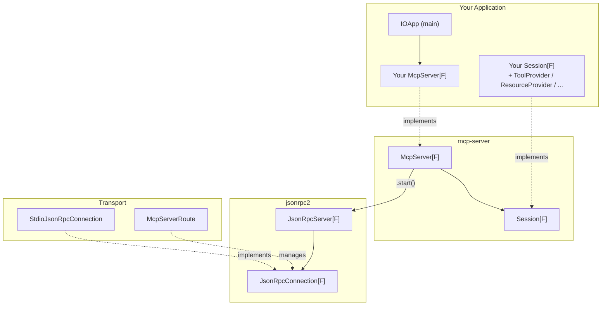
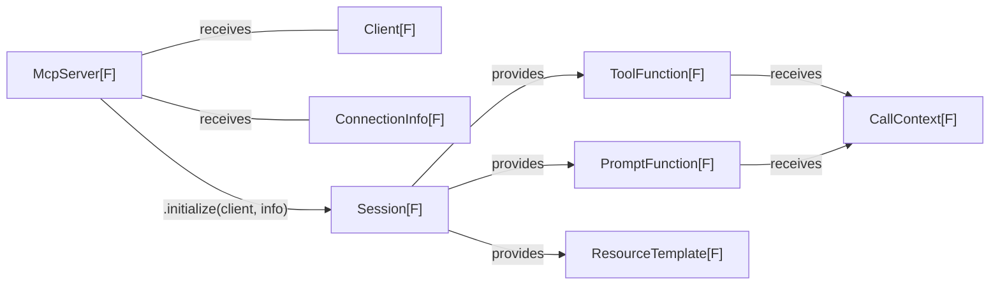
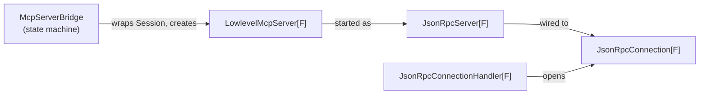
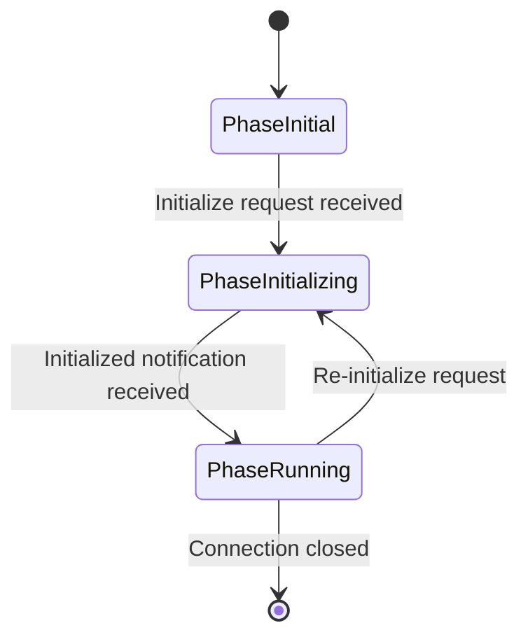

# Architecture

The library is structured in layers, each building on the one below.

## Layer Overview



## Server & Session

When a client connects, `McpServer.initialize` is called and returns a `Session` -- the session holds all capabilities for that connection.



## Internal Wiring

The internal layers bridge the high-level `Session` API down to the transport. `McpServerBridge` manages the connection lifecycle as a state machine, `LowlevelMcpServer` handles JSON-RPC request/response correlation.



## Core Types

### McpServer\[F\]

The main entry point for implementing an MCP server. It has a single method:

```scala
def initialize(client: Client[F], info: ConnectionInfo[F]): Resource[F, Session[F]]
```

When a client connects and sends an `initialize` request, this method is called. It receives a `Client[F]` (for communicating back to the client) and `ConnectionInfo[F]` (metadata about the connection, including authentication), and returns a `Session[F]` wrapped in a `Resource` for lifecycle management.

Use the `.start(connection, logError)` extension method to wire a server to a transport and run it.

### Session\[F\]

Represents an active MCP session after initialization. The base trait defines:

- `serverInfo: PartyInfo` -- name and version of your server
- `instructions: F[Option[String]]` -- optional instructions for the AI client

A session on its own does not expose any capabilities. To advertise tools, resources, or prompts, mix in the corresponding **capability traits**:

| Trait | What it adds |
|---|---|
| `ToolProvider[F]` | `tools: F[List[ToolFunction[F]]]` |
| `ToolProviderWithChanges[F]` | adds `toolChanges` stream for dynamic tool lists |
| `PromptProvider[F]` | `prompts: F[List[PromptFunction[F]]]` |
| `PromptProviderWithChanges[F]` | adds `promptChanges` stream |
| `ResourceProvider[F]` | `resources(...)`, `resource(...)`, `resourceTemplates(...)` |
| `ResourceProviderWithChanges[F]` | adds `resourceChanges` stream |
| `ResourceSubscriptionProvider[F]` | `resourceSubscription(...)` for live updates |
| `RootChangeAwareProvider[F]` | `rootsChanged` callback when client roots change |

The library inspects which traits your session implements and automatically negotiates the corresponding capabilities with the client.

### Client\[F\]

Provided to your server during initialization, `Client[F]` is how you communicate back to the connected AI client. It exposes:

- `ping` -- check if the client is still alive
- `log(level, logger, message)` -- send log messages to the client
- `elicit(message, fields)` -- ask the user for additional information
- `sample(messages, maxTokens, ...)` -- request an LLM completion from the client
- `listRoots` -- list the client's root URIs
- `clientInfo` / `capabilities` -- metadata about the connected client

### ConnectionInfo\[F\]

Provides connection metadata available throughout the session:

- `authentication: F[Authentication]` -- the current authentication token (kept up-to-date as the client sends new tokens)
- `connection: JsonRpcConnection.Info` -- transport-level info (Stdio, Http, or Other)

### ToolFunction\[F\]

Represents a callable tool. Create instances using the factory methods:

- `ToolFunction.text(info, f)` -- tool that returns plain text
- `ToolFunction.structured(info, f)` -- tool that returns a typed JSON object
- `ToolFunction.native(info, schema, f)` -- tool with manual JSON handling

Each tool receives a `CallContext[F]` that provides `reportProgress(...)` and `log(...)` for communicating status back to the client during execution.

### CallContext\[F\]

Passed to tool, prompt, and resource handlers during execution. Provides:

- `meta: Meta` -- request metadata from the client
- `reportProgress(progress, total, message)` -- report execution progress
- `log(level, message)` -- send log messages scoped to the current operation

## Internal Wiring Details

You typically don't interact with these types directly, but understanding them helps when debugging or extending the library.

### LowlevelMcpServer\[F\]

Handles JSON-RPC request/response correlation and MCP message dispatching. It translates raw `ClientRequest`/`ClientNotification` messages into calls on your `Session`.

### McpServerBridge (State Machine)

Manages the session lifecycle through three phases:



- **PhaseInitial** -- waiting for the `Initialize` request; only `Ping` is accepted
- **PhaseInitializing** -- `Initialize` processed, `Session` created; waiting for the client's `Initialized` notification
- **PhaseRunning** -- fully operational; tools, resources, prompts, and all other MCP features are available

### JsonRpcServer\[F\] / JsonRpcConnection\[F\]

The JSON-RPC layer. `JsonRpcConnection[F]` is the transport abstraction (an input `Stream` and an output `Pipe`). `JsonRpcServer[F]` wires the message handler to the connection and merges the input and output streams.

## Transport Implementations

### Stdio (`jsonrpc2-stdio`)

`StdioJsonRpcConnection` reads/writes JSON-RPC messages over standard input/output. Best for local tool processes launched by the AI client.

```scala
Server().start(
  StdioJsonRpcConnection.create[IO],
  e => IO(System.err.println(s"Error: $e")),
).useForever
```

### Streamable HTTP (`mcp-server-http4s`)

`McpServerRoute` provides http4s routes for MCP over HTTP with session management:

| Route | Purpose |
|---|---|
| `POST /mcp` | Send requests and receive responses (SSE stream) |
| `GET /mcp` | Stream server-initiated notifications (SSE) |
| `DELETE /mcp` | Close a session |

Sessions are tracked via the `Mcp-Session-Id` header and managed by a `SessionStore`.
