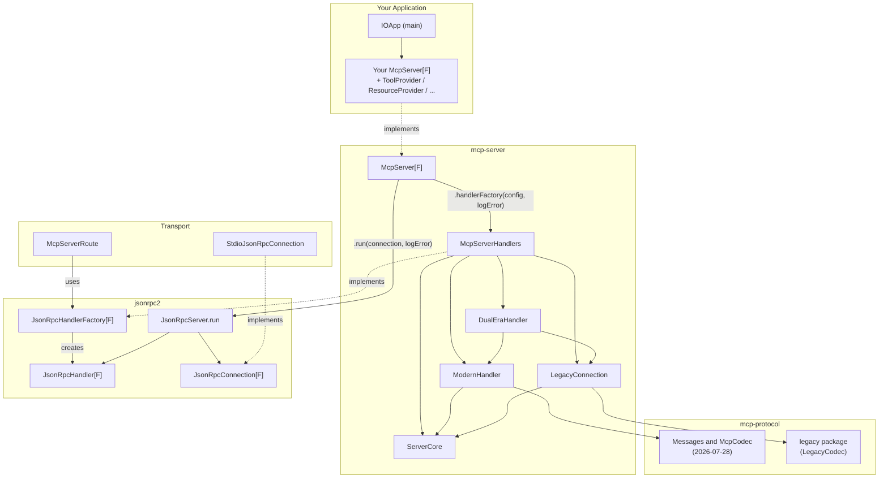
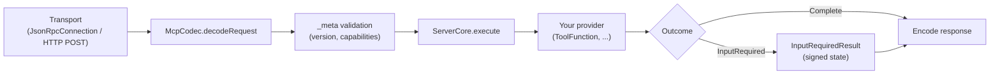
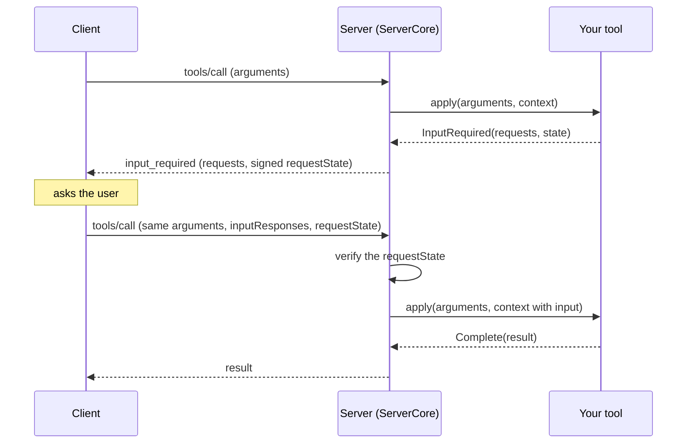

# Architecture

The library is structured in layers, each building on the one below. The public interface follows MCP revision 2026-07-28: servers are stateless and every request carries what the server needs to know about the client. Clients of the revisions 2025-06-18 and 2025-11-25 are adapted to this model inside the library.

## Layer Overview


```mermaid
graph TB
    subgraph "Your Application"
        App["IOApp (main)"]
        YourServer["Your McpServer[F]\n+ ToolProvider / ResourceProvider / ..."]
    end

    subgraph "mcp-server"
        McpServer["McpServer[F]"]
        Handlers["McpServerHandlers"]
        Core["ServerCore"]
        Modern["ModernHandler"]
        Legacy["LegacyConnection"]
        DualEra["DualEraHandler"]
    end

    subgraph "mcp-protocol"
        Protocol["Messages and McpCodec\n(2026-07-28)"]
        LegacyPkg["legacy package\n(LegacyCodec)"]
    end

    subgraph "jsonrpc2"
        Factory["JsonRpcHandlerFactory[F]"]
        Handler["JsonRpcHandler[F]"]
        JsonRpcServer["JsonRpcServer.run"]
        JsonRpcConn["JsonRpcConnection[F]"]
    end

    subgraph "Transport"
        Stdio["StdioJsonRpcConnection"]
        Http["McpServerRoute"]
    end

    App --> YourServer
    YourServer -.->|implements| McpServer
    McpServer -->|".handlerFactory(config, logError)"| Handlers
    McpServer -->|".run(connection, logError)"| JsonRpcServer
    Handlers -.->|implements| Factory
    Handlers --> Core
    Handlers --> Modern
    Handlers --> Legacy
    Handlers --> DualEra
    Modern --> Core
    Legacy --> Core
    DualEra --> Modern
    DualEra --> Legacy
    Modern --> Protocol
    Legacy --> LegacyPkg
    Factory -->|creates| Handler
    JsonRpcServer --> Handler
    JsonRpcServer --> JsonRpcConn
    Stdio -.->|implements| JsonRpcConn
    Http -->|uses| Factory
```

## Layers

### jsonrpc2

The JSON-RPC 2.0 layer, independent of MCP.

* `JsonRpcConnection[F]` is the transport abstraction: an input `Stream` of `MessageEnvelope` (message and authentication), an output `Pipe`, and `info` (stdio, http or other).
* `JsonRpcHandler[F]` handles the messages of a connection. `request` returns a stream with the messages that belong to the request (notifications, requests to the client) followed by the response. Cancelling the stream cancels the request. `notification` and `response` receive the other incoming messages, `unsolicited` provides messages that do not belong to a request, `cancelledRequest` extracts the id of the request that a notification cancels.
* `JsonRpcHandlerFactory[F]` provides a `stateless` handler (messages without a connection, used by HTTP), a `connection(info)` resource with the handler of one connection (a stdio process or a legacy HTTP session) and `supportsSessions`.
* `JsonRpcServer.run` reads a connection until its input ends. Every request runs in its own fiber and the messages are written to the connection as they are produced. `JsonRpcServer.serve` does the same with the handler of `factory.connection(info)`.

### mcp-protocol

The MCP messages as Scala types with circe codecs. `McpCodec` decodes requests and notifications of 2026-07-28 and encodes responses. Each request has a `_meta` with the protocol version and the capabilities of the client (`RequestInfo`).

The `legacy` package holds what only exists in the earlier revisions: `Initialize`, `Ping`, `SetLevel`, `Subscribe`, `Unsubscribe`, and the `LegacyCodec` that reads the messages of legacy clients and writes the responses for them (see [Legacy clients](#legacy-clients)).

### mcp-server

* `McpServer[F]` is what you implement: `serverInfo`, `instructions`, and the provider traits (`ToolProvider`, `PromptProvider`, `ResourceProvider` and their `*WithChanges` variants, `ResourceSubscriptionProvider`). The extension methods `handlerFactory(config, logError)` and `run(connection, logError)` serve it.
* `McpServerHandlers` is the `JsonRpcHandlerFactory` of a server.
* `ServerCore` executes requests independent of the protocol version: dispatch to the providers, capabilities, request state, cache hints, change streams.
* `ModernHandler` serves clients of 2026-07-28 (decoding, `_meta` validation, response encoding, `subscriptions/listen`).
* `LegacyConnection` serves one connection of a legacy client.
* `DualEraHandler` decides per message between the two on stdio.

### Transports

* `jsonrpc2-stdio`: `StdioJsonRpcConnection` (line based framing).
* `mcp-server-http4s`: `McpServerRoute`, `McpServerRouteConfig`, `SessionStore`, `OAuthMiddleware`.

## Core Types

### McpServer\[F\]

The main entry point for implementing an MCP server. It is stateless: the same instance serves all clients and requests. The base trait defines:

* `serverInfo: Implementation`: name and version of your server
* `instructions: F[Option[String]]`: optional instructions for the AI client
* `maxPageSize: Int`: maximum number of resources on a page (default 100)

To advertise tools, resources, or prompts, mix in the corresponding **provider traits**:

| Trait | What it adds |
|---|---|
| `ToolProvider[F]` | `tools(context): F[List[ToolFunction[F]]]`, `toolsCache: CacheHint` |
| `ToolProviderWithChanges[F]` | adds `toolChanges: Stream[F, Unit]` |
| `PromptProvider[F]` | `prompts(context): F[List[PromptFunction[F]]]`, `promptsCache: CacheHint` |
| `PromptProviderWithChanges[F]` | adds `promptChanges: Stream[F, Unit]` |
| `ResourceProvider[F]` | `resources(after, context)`, `resourceTemplates(after, context)`, `resource(uri, context): F[Outcome[ReadResource.Response]]`, `resourcesCache: CacheHint` |
| `ResourceProviderWithChanges[F]` | adds `resourceChanges: Stream[F, Unit]` |
| `ResourceSubscriptionProvider[F]` | `resourceUpdates(uri, context): Stream[F, ResourceUpdated]` for the updates of a single resource |

The library inspects which traits your server implements and derives the capabilities from them (`ServerCore.capabilities`). Completion is advertised when the server is a `PromptProvider` or a `ResourceProvider`.

The change streams are server wide, they do not depend on a client. The list methods may vary their result by the authentication of the request but not by anything else.

### RequestContext\[F\]

Passed to every provider method and to tool, prompt and resource handlers. It provides:

* `client: ClientInfo`: the self reported `Option[Implementation]` and the `ClientCapabilities` of the request
* `authentication: Authentication`: `Anonymous` or `BearerToken(token)`, as received with this request
* `transport: JsonRpcConnection.Info`: how the request arrived (stdio, http with addresses)
* `meta: Meta`: the `_meta` of the request
* `input: InputContext`: the answers of the client and the state, when the request is the retry of a request that needed input
* `reportProgress(progress, total, message)`: reports progress (does nothing when the client sent no progress token)

### ToolFunction\[F\]

Represents a callable tool. Create instances using the factory methods:

* `ToolFunction.text(info, f)`: tool that returns plain text
* `ToolFunction.structured(info, f)`: tool that returns a typed JSON object
* `ToolFunction.interactiveText(info, f)` and `ToolFunction.interactiveStructured(info, f)`: like the above, `f` also receives an `Ask[F]` to ask the user questions
* `ToolFunction.native(info, argsSchema, f)`: tool with manual JSON handling that returns an `Outcome`

Arguments that cannot be decoded are reported as a tool error, not as a protocol error. A `ToolFunction.ToolError` raised by the function becomes an error result as well.

### Outcome\[A\]

`tools/call`, `prompts/get` and `resources/read` return `F[Outcome[...]]`, all other handlers return plain results.

* `Outcome.Complete(value)`: the request is done
* `Outcome.InputRequired(requests, state)`: the client has to ask the user and retry the request with the answers

`Outcome.elicit(key, message, fields*)` builds an `InputRequired` with a form. `ElicitationField` describes the fields (`Text`, `YesNo`, `Number`, `Choice`).

### Ask\[F\]

The sequential style for `InputRequired`. `ask.elicit(key, message, fields*)`, `ask.elicitUrl(key, message, url)` and `ask.elicitAll(questions*)` return the answers as `ElicitResult`. See [Input required](#input-required).

### CacheHint

`CacheHint(ttl, scope)` tells clients for how long they may keep a result and who may cache it. `CacheHint.none` (the default) marks a result stale immediately, `CacheHint.public(ttl)` allows shared caches, `CacheHint.perAuthorization(ttl)` allows reuse only for the same authorization.

### McpServerConfig

* `requestState: RequestStateConfig`: how the state of input required results is protected
* `supportLegacyClients: Boolean` (default `true`): also serve 2025-06-18 and 2025-11-25
* `maxLegacyInputRounds: Int` (default 10): how often a request is retried for a legacy client

### McpError

`McpError.error(code, message, data)` creates an exception that is reported to the client with this code. `McpError.resourceNotFound(uri)` is the error for a missing resource (code `-32602` for current clients, `-32002` for legacy clients). Other exceptions are logged with `logError` and answered with an internal error.

## Request Flow


```mermaid
graph LR
    Transport["Transport\n(JsonRpcConnection / HTTP POST)"]
    Decode["McpCodec.decodeRequest"]
    Meta["_meta validation\n(version, capabilities)"]
    Execute["ServerCore.execute"]
    Provider["Your provider\n(ToolFunction, ...)"]
    Input{"Outcome"}
    Encode["Encode response"]
    InputRequired["InputRequiredResult\n(signed state)"]

    Transport --> Decode --> Meta --> Execute --> Provider --> Input
    Input -->|Complete| Encode
    Input -->|InputRequired| InputRequired --> Encode
```

For a request of a 2026-07-28 client, `ModernHandler.handle` does:

1. **Decode**: `McpCodec.decodeRequest` maps the method and params to a request type. An unknown method is answered with `-32601`, invalid params with `-32602`.
2. **`_meta` validation**: `RequestInfo.fromMeta` reads `io.modelcontextprotocol/protocolVersion` and `io.modelcontextprotocol/clientCapabilities` (both required, `clientInfo` is optional). A missing field is answered with `-32602`. A protocol version other than 2026-07-28 is answered with an unsupported protocol version error whose data lists the supported versions (2026-07-28 plus the legacy versions when they are enabled).
3. **Execute**: `ServerCore.execute` builds the `RequestContext` and calls the provider. `server/discover` is answered by the handler, because it knows the supported versions. For `tools/call`, `prompts/get` and `resources/read` the request state is checked first (see below).
4. **Input required**: when the provider returns `Outcome.InputRequired`, the core checks that the client declared the needed capability (otherwise it answers with a missing capability error), signs the state and returns an `InputRequiredResult`.
5. **Encode**: the response is encoded with `resultType`, the cache hint (`ttlMs`, `cacheScope`) and the `serverInfo` in `_meta`.

Lists of tools and prompts are sorted by name. Pages of resources have at most `maxPageSize` elements, the next cursor is the cursor of the last element on the page.

The handler runs in the background and the response stream emits the notifications of the request (progress) before the response. Cancelling the stream cancels the handler.

## Input Required

A server that needs information from the user does not call the client. It answers the request with an `InputRequiredResult` (`resultType: "input_required"`) that contains the questions (`inputRequests`, by a key chosen by the server) and optionally a `requestState`. The client asks the user and sends the same request again with `inputResponses` and the `requestState`.


```mermaid
sequenceDiagram
    participant C as Client
    participant S as Server (ServerCore)
    participant T as Your tool

    C->>S: tools/call (arguments)
    S->>T: apply(arguments, context)
    T-->>S: InputRequired(requests, state)
    S-->>C: input_required (requests, signed requestState)
    Note over C: asks the user
    C->>S: tools/call (same arguments, inputResponses, requestState)
    S->>S: verify the requestState
    S->>T: apply(arguments, context with input)
    T-->>S: Complete(result)
    S-->>C: result
```

Because the server keeps no memory between the two calls, the handler runs again from the start on the retry. `context.input` holds the answers (`input.elicit(key)`) and the state returned earlier.

### Ask

`ToolFunction.interactiveText` and `interactiveStructured` hide the retry behind `ask.elicit(...)`. `Ask.run` collects the answers of earlier rounds (kept in the state as JSON) and of this retry, and runs the function. A question that is already answered returns its answer. The first question without an answer raises an exception that is used for control flow, `Ask.run` turns it into `Outcome.InputRequired` with the questions of this round and all answers so far as state. `ask.elicitAll` puts several questions into one round. Side effects before a question run again on every retry.

### Request state

The `requestState` passes through the client, therefore `RequestStateProtector` protects it: HMAC-SHA256 over a payload with the expiry, the principal, the method, the target (tool or prompt name, resource uri), the hash of the arguments and the state. On a retry the server rejects a state that has a wrong signature, is expired, or was created for another principal, method, target or arguments (answered with `-32602`). The state is signed, not encrypted: the client can read it.

`RequestStateConfig` sets the keys (the first one signs, all verify, which allows rotation), the time to live (default 10 minutes) and the principal (by default a hash of the bearer token). The default config uses a random key per process. A server with several instances needs the same keys on all instances.

The result of a retry carries no cache hint: `resources/read` uses `ttlMs = 0` and a private scope for it.

## Subscriptions

Clients of 2026-07-28 learn about changes with `subscriptions/listen`. The request names what the client wants: list changes of tools, prompts and resources, and a list of resource uris. `ModernHandler` answers with a stream:

1. `notifications/subscriptions/acknowledged` with the part of the filter that the server accepts (what it supports through the `*WithChanges` traits and `ResourceSubscriptionProvider`)
2. the notifications (`tools/list_changed`, `prompts/list_changed`, `resources/list_changed`, `resources/updated`), each tagged with the subscription id (the request id) in `_meta`
3. a final empty result when the server ends the subscription

The notifications come from `toolChanges`, `promptChanges`, `resourceChanges` and `resourceUpdates(uri, context)`, merged in `ServerCore.listen`. The handler starts these streams before it sends the acknowledgement, so that a change which a client causes right after the acknowledgement is not lost. A stream has to register its subscription when it is started (`Topic.subscribe` does). The stream ends when the client cancels it (closes the HTTP stream or sends `notifications/cancelled` on stdio).

## Legacy clients

Clients of 2025-06-18 and 2025-11-25 expect a stateful connection. When `supportLegacyClients` is on, `LegacyConnection` provides it and keeps the state of the connection (negotiated version, client information and capabilities, resource subscriptions). The server implementation stays stateless.

* **Handshake**: the first request is `initialize`. The connection answers with the negotiated version (the requested version if it is 2025-06-18 or 2025-11-25, else 2025-11-25), the capabilities and the `serverInfo` of the server. Before the handshake only `initialize` and `ping` are accepted, other requests are rejected with `-32600`. The `notifications/initialized` notification needs no action.
* **Per request information**: what a 2026-07-28 client sends with each request is taken from the handshake and put into the `RequestContext`.
* **Ping, logging**: `ping` is answered with an empty result. `logging/setLevel` is accepted and ignored, no `logging` capability is advertised.
* **Change notifications**: after the handshake the connection forwards the list changes of the server as notifications. `resources/subscribe` and `resources/unsubscribe` start and stop forwarding the updates of a resource (`resourceUpdates`).
* **Input requests**: when the provider returns `InputRequired`, the connection sends each request to the client as `elicitation/create` while the original request is pending, waits for the answers and executes the request again with the answers and the state (like a 2026-07-28 client would do). After `maxLegacyInputRounds` rounds the request fails with an internal error.
* **Downgrade of results**: `LegacyCodec.encodeResponse` converts the 2026-07-28 results to the shape of the negotiated version. It removes `resultType`, `ttlMs`, `cacheScope`, the `serverInfo` in `_meta` and `structuredContent` that is not an object, and for 2025-06-18 also the icons and the additional fields of the server info.
* **Errors**: a missing resource is reported with `-32002` instead of `-32602`.
* **Cancellation**: `notifications/cancelled` stops the request.

On stdio `DualEraHandler` serves both generations on one connection. A connection that starts with `initialize` is a legacy connection for its whole life. Until then `initialize` and `ping` go to the legacy connection and every other request is handled by the `ModernHandler`. On HTTP a legacy client opens a session with `initialize` and all further messages of that client go to the connection of the session. Without legacy support the factory only has the stateless handler and `initialize` is rejected.

## Transport Implementations

### Stdio (`jsonrpc2-stdio`)

`StdioJsonRpcConnection` reads/writes JSON-RPC messages over standard input/output, one message per line. Best for local tool processes launched by the AI client. Write diagnostics to stderr only.

```scala
Server().run(
  StdioJsonRpcConnection.create[IO],
  e => IO(System.err.println(s"Error: $e")),
)
```

`run` returns when the client closes the input. The generation of the client is chosen per message (see above). Cancellation uses `notifications/cancelled`.

### Streamable HTTP (`mcp-server-http4s`)

`McpServerRoute.route(factory, config, root)` provides the http4s routes under `{root}/mcp`:

| Route | Purpose |
|---|---|
| `POST /mcp` | Send a request, notification or response |
| `GET /mcp` | Message stream of a legacy session |
| `DELETE /mcp` | Close a legacy session |
| other methods | 405 |

```scala
for
  given SessionStore[IO] <- SessionStore.inMemory[IO](30.minutes)
  factory = Server().handlerFactory(McpServerConfig.default, logError)
  route = McpServerRoute.route(factory)
yield route
```

Behavior of `POST`:

* **Header validation**: a request without session is handled by `factory.stateless`. Before that the transport validates the headers against the body and answers a mismatch with status 400 and error `-32020`. `MCP-Protocol-Version` has to be present and equal to `io.modelcontextprotocol/protocolVersion` in the `_meta` (a body without the version is left to the handler, which answers it with `-32602`), `Mcp-Method` has to equal the method, and `Mcp-Name` has to equal `name` (`tools/call`, `prompts/get`) or `uri` (`resources/read`). A Base64 value in the form `=?base64?<value>?=` is decoded (the padding is mandatory). The transport passes the `Mcp-Param-*` headers to the handler (`JsonRpcHandler.Context.paramHeaders`), because only the handler knows the schemas of the tools: `ServerCore` compares the header of every parameter with an `x-mcp-header` annotation (`McpHeaderAnnotations.validateRequest`) with the value in the arguments and answers a missing or different header, invalid Base64 and invalid characters with `-32020`. An `initialize` request that carries the protocol version in its `_meta` is a request of a current client and a removed method (404), the other `initialize` requests open a legacy session.
* **JSON or SSE**: the response is a single `application/json` message. When the handler emits other messages before the response (progress), the response is a `text/event-stream` that ends after the response. `subscriptions/listen` is always a stream. Streams carry keep-alive comments (`McpServerRouteConfig.keepAliveInterval`, default 30 seconds) and the header `X-Accel-Buffering: no`.
* **Status codes**: errors with the codes `-32700`, `-32600`, `-32602`, `-32020`, `-32021` and `-32022` are answered with 400, an unknown method (`-32601`) with 404, other errors with 200. Notifications are answered with 202. A response of the client without a session is rejected with 400.
* **Cancellation**: when the client closes the connection, the stream of the handler is cancelled, which stops the handler.
* **Sessions only for legacy clients**: `initialize` opens a session when the factory supports sessions (`supportLegacyClients`). The response carries the `Mcp-Session-Id` header and the session is kept in the `SessionStore` until `DELETE` or the idle timeout. All messages with that header are routed to the handler of the session. `GET` with a session id opens the stream for the messages that do not belong to a request. Without session support `initialize` is rejected with 400 and the header is ignored.
* **Origin check**: a request with an `Origin` header is answered with 403 unless `McpServerRouteConfig.originAllowed` accepts it (default: `localhost`, `127.0.0.1` and `[::1]`). The host of the request is not taken into account, because with DNS rebinding the origin of the attacker has the same host as the request. Requests without an `Origin` header are accepted.
* **Authentication**: the bearer token that `OAuthMiddleware` stored in the request (or `Anonymous`) ends up in `RequestContext.authentication`.

Resumable streams (`Last-Event-ID`) are not supported.

`OAuthMiddleware(name, authorizationServers, scopes, validateToken, root, audienceOverride)` protects the `/mcp` route with bearer tokens and serves the protected resource metadata. `validateToken` returns a `TokenValidation`: `Valid`, `Invalid` (answered with 401) or `InsufficientScope(requiredScopes)` (answered with 403 and `error="insufficient_scope"`).
